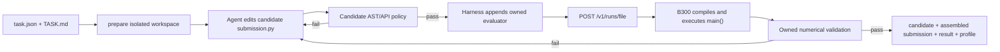

# Цель проекта и pipeline

## Цель

Построить рабочий контур, в котором coding agent получает формализованную
tensor-задачу и создаёт CuTe DSL candidate для FP8/FP4. Сейчас мы разрабатываем
только локальный harness и используем существующий сервер как неизменяемый
исполнитель одного Python-файла.

## Harness-only v1



### Agent context

Агент получает только:

```text
TASK.md
task.json without baseline path
submission.py with constants and kernel/JIT stubs
```

Он не получает `main()`, input generation, PyTorch reference, assertions или
PASS marker.

### Candidate policy

`python -m cute_harness check` проверяет:

- Python syntax и размер файла;
- import allowlist;
- запрет filesystem/network/dynamic execution;
- отсутствие `main()` и module-level PASS printing;
- отсутствие PyTorch reference compute;
- количество `@cute.kernel` и `@cute.jit`;
- task-specific CuTe calls.

Это сильный compatibility/integrity guard, но не полноценная OS sandbox.

### Assembly

Private часть `starter.py` отделена marker-строкой
`CUTE_HARNESS_EVALUATOR_V1`. `prepare` копирует только candidate-префикс.
`run` после успешного check объединяет candidate с evaluator suffix во временный
standalone `submission.py`.

Существующий remote API не меняется:

```text
POST /v1/runs/file
multipart: assembled submission.py, profiler
```

### Acceptance

Run принимается только если:

- `success == true`;
- `exit_code == 0`;
- `timed_out != true`;
- stdout соответствует task-specific success pattern.

PASS печатает только owned evaluator после numerical validation.

### Artifacts

Для каждого run сохраняются:

- `candidate.py` и его SHA-256;
- точный assembled `submission.py` и его SHA-256;
- manifest/prompt/starter hashes;
- stdout/stderr и полный server response;
- profiler trace;
- model/experiment label.

API key в artifacts не сериализуется.

## Что остаётся ограничением

Без доступа к серверному коду нельзя обеспечить настоящий hidden evaluator:

- сервер не знает `task_id`;
- тестовый seed и shapes принадлежат локальному template;
- сервер не изолирует candidate от evaluator на уровне процесса;
- нельзя гарантировать отдельные correctness/performance phases.

Для текущей цели — обучать агента писать настоящий CuTe и собирать compiler
feedback — harness-only v1 достаточен.

## Следующие harness-only шаги

1. Attempt registry с лимитом попыток и model metadata.
2. Нормализация compiler/runtime diagnostics.
3. Отдельный functional status и device-time observation.
4. Несколько локальных evaluator templates на задачу.
5. FP4 task schema со scale layout и accumulator contract.
