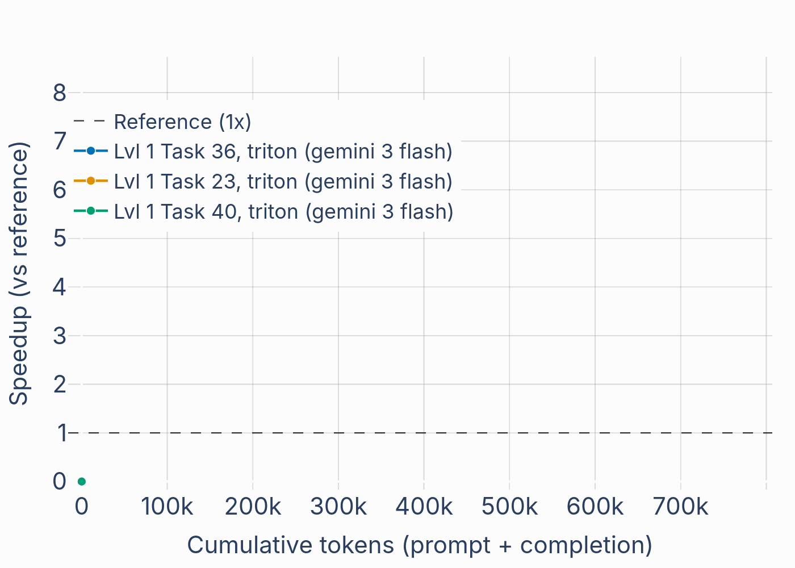
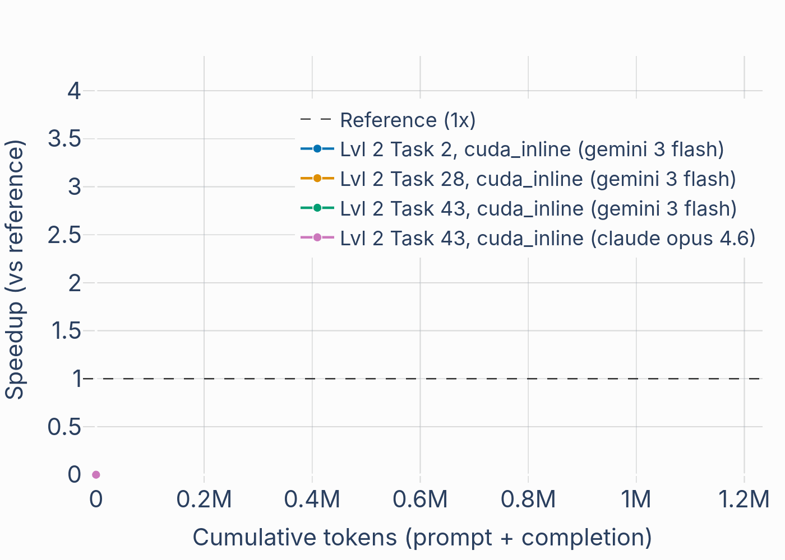

<div align="center">
  
</div>

**Evolutionary generation of efficient GPU kernels** using [GigaEvo](https://github.com/FusionBrainLab/gigaevo-core).  
Define a task, run evolution with an LLM backend, extract and compare optimized programs.

<div align="center">
  
  
</div>


## Features

- **Custom tasks** — Define your own kernel tasks in KernelBench format and evolve them.
- **KernelBench integration** — Use existing [KernelBench](https://github.com/ScalingIntelligence/KernelBench) problems.
- **Triton and CUDA inline backends** - two most popular ways to create kernels, suitable for different scenarios.
- **Remote or local execution** — Run validation locally or via a remote eval server.
- **Visible agent mode** — Codex/Claude authors isolated island candidates while KernelEvo owns evaluation,
  profiling, archive state, promotion, and deterministic reports.
- **Cost efficient** - works with fast models **gemini flash 3** and **gpt-oss-120b**. Current experiments costs **0.5-1$**. 
Frontier models with high reasoning effort would be beneficial, yet cost would be magnitude higher.
---

## Requirements

- **Python** >= 3.12
- **LLM API** — OpenAI-compatible (e.g. [OpenRouter](https://openrouter.ai), or a local server like SGLang).  
- **Redis** — Used by GigaEvo for experiment state.
- **GPU** — Used by the evaluation stage to measure kernel correctness and efficiency.
---

## Installation

### From source

```bash
git clone https://github.com/AXXX-Institute/kernel-evo.git
cd kernel-evo
pip install -e . --ignore-requires-python
```

> **Note:** `--ignore-requires-python` relaxes the Python version check (KernelBench may declare 3.10 but works on 3.12).  
> For custom branches of `gigaevo` or `kernelbench`, edit the Git URLs in `pyproject.toml`.

### Docker

Pull and run (when a pre-built image is published):

```bash
docker pull sivtsovdt/kernel-evo:latest
docker run --rm sivtsovdt/kernel-evo:latest kernel-evo --help
```

To build the image yourself (e.g. for private dependencies or development), see **[build/README.md](build/README.md)**.

---

## Custom kernel task

To evolve your own kernel, create a task in **KernelBench format**. Example layout:

```
tasks/
└── armt_associate/
    └── task.py
```

See `tasks/armt_associate` in this repo for a reference. You can also use any existing task from [KernelBench](https://github.com/ScalingIntelligence/KernelBench).

---

## Run evolution

Evolution can use a **local** or **remote** LLM (e.g. SGLang, OpenRouter). Examples below use OpenRouter and a remote eval server.

### 1. Start the eval server (optional, for remote validation)

In a separate terminal:

```bash
kernel-evo eval-server --port 15000
```

### 2. Evolve with a custom task

```bash
OPENAI_API_KEY="sk-or-v1-..." kernel-evo evolve \
  --problem-path tasks/armt_associate/task.py \
  --experiment-name custom_associate \
  --backend triton \
  --precision fp16 \
  --model-name <MODEL> \
  --llm-base-url https://openrouter.ai/api/v1 \
  --redis-db 0 \
  --max-generations 400 \
  --max-mutations-per-generation 4 \
  --validator-debug \
  --log-dir <dir_for_logs> \
  --execution-mode remote_execution
```

### 3. Evolve with a KernelBench task

```bash
OPENAI_API_KEY="<KEY>" kernel-evo evolve \
  --level 1 \
  --problem-id 36 \
  --experiment-name kb_level1_36 \
  --dataset-src huggingface \
  --dataset-name ScalingIntelligence/KernelBench \
  --backend triton \
  --precision fp16 \
  --model-name <MODEL> \
  --llm-base-url https://openrouter.ai/api/v1 \
  --redis-db 0 \
  --max-generations 400 \
  --max-mutations-per-generation 4 \
  --validator-debug \
  --log-dir <dir_for_logs> \
  --execution-mode remote_execution
```

---

## Monitor progress

```bash
cd gigaevo/outputs/<DATE>/<EXPERIMENT_START>
tensorboard --logdir .
```

Use TensorBoard to find iterations with good performance before extracting programs.

---

## Use KernelEvo directly from Codex or Claude

Agent mode uses a visible barrier loop. KernelEvo prepares one compact, isolated authoring packet per island;
the coordinator delegates those packets, then KernelEvo evaluates every candidate and updates the archive.
The existing `kernel-evo evolve` direct-LLM CLI remains unchanged.

Start a run from the included [example config](examples/agent/evo.yaml):

```bash
kernel-evo run init --config examples/agent/evo.yaml
kernel-evo run status --run-id <RUN>
kernel-evo iter prepare --run-id <RUN>
# Codex/Claude authors each returned candidate file in parallel.
kernel-evo iter evaluate --run-id <RUN>
kernel-evo iter report --run-id <RUN> --format markdown
kernel-evo iter advance --run-id <RUN>
```

`iter prepare` writes `TASK.md`, `IDEA.md`, `FEEDBACK.md`, `RULES.md`, a read-only baseline, and one editable
candidate under `runs/iter_NNN/island_N`. Editing the prepared candidate is an implicit submission; use
`island submit` when copying an external candidate or recording its rationale. Preparation and interrupted
evaluation are resumable.

The same harness is available without CLI parsing:

```python
from kernel_evo import KernelEvoAgent

evo = KernelEvoAgent(".kernelevo/runs")
status = evo.init_run("examples/agent/evo.yaml")
tasks = evo.prepare_iteration(status["run_id"])
# Delegate each task.task_file; authors edit task.candidate_path.
report = evo.evaluate_iteration(status["run_id"])
```

For a non-KernelBench harness, configure `evaluation.command`. KernelEvo substitutes `{candidate}`,
`{baseline}`, `{iteration}`, and `{island}` and consumes one JSON metrics object from stdout. Project-local
Codex and Claude skills enforce the one-patch-per-author contract.

### CuTe tasks on B300

The repository includes nine FP8 tasks and one packed FP4 task under `tasks/cute`.
Candidates keep the common `ModelNew.forward` interface; task-owned code
supplies inputs, correctness checks, and timing.

```bash
export CUTE_HARNESS_API_KEY=<key>
kernel-evo cute task-list
kernel-evo run init --config examples/agent/airi_cute_b300.yaml
```

The B300 evaluator runs through the `iter` barrier loop. Set
`b300_seed: starter` to have the agent write the kernel from the public
skeleton, or `baseline` to have it modify the verified reference.

Use `--documentation-tier bare|docs|examples|errors` to select the cumulative
CuTe context supplied to `run init` and `iter prepare`. The added files are
fixed per tier and never selected by task or operation. `bare` supplies no
documentation beyond the task statement; `docs` adds the local API and
foundations. The study design, runner, stability evidence, and analysis live in
[`experiments/cute_ablation`](experiments/cute_ablation/README.md), and the
single-run workflow in [`tasks/cute/README.md`](tasks/cute/README.md).

---

## Extract a program

Export the program from a specific iteration (e.g. after inspecting TensorBoard):

```bash
kernel-evo extract \
  --redis-db 0 \
  --iteration 8 \
  --redis-prefix "kernel_evo" \
  --output-file best_program.py
```

---

## Compare two programs

### Custom task

```bash
kernel-evo compare \
  --program-a prog_a.py \
  --program-b prog_b.py \
  --problem-path tasks/armt_associate/task.py \
  --backend triton \
  --precision fp16 \
  --num-perf-trials 200 \
  --num-correct-trials 20
```

### KernelBench task

```bash
kernel-evo compare \
  --program-a prog_a.py \
  --program-b prog_b.py \
  --dataset-src huggingface \
  --dataset-name ScalingIntelligence/KernelBench \
  --level 1 \
  --problem-id 36 \
  --backend triton \
  --precision fp16 \
  --num-perf-trials 200 \
  --num-correct-trials 20
```

---

## Profile kernels during evolution

Optional Nsight Compute and/or PyTorch-profiler runs whose output is fed back into the mutation prompt as performance insights.

```bash
kernel-evo evolve ... \
  --enable-profiler-stage \
  --profile-runners torch,ncu \
  --profile-ncu-min-speedup 1.0
```

Key flags:
- `--enable-profiler-stage` — turn on the optional `ProfileMutationContextStage`.
- `--profile-runners` — comma-separated: `torch`, `ncu`, or both.
- `--profile-max-insights` — cap on insights surfaced per program (default 4).
- `--profile-torch-warmup-steps` / `--profile-torch-active-steps` — torch profiler stepping.
- `--profile-ncu-path` — `ncu` executable (resolved from PATH by default).
- `--profile-ncu-set` — NCU section set (default `full`).
- `--profile-ncu-kernel-name` — optional `--kernel-name` filter for NCU.
- `--profile-ncu-extra-args` — raw extra args appended to the ncu command line.
- `--profile-ncu-min-speedup` — only run NCU when measured speedup ≥ this threshold (default 1.0; skips wastefully profiling slow programs).

Profile artifacts (json/qdrep/etc.) are written to `<log-dir>/<problem>/artifacts/`.

---

## Reuse memory across runs

Build a memory bank from one or more finished evolve runs, then feed it into newer runs read-only. The bank is a directory containing `api_index.json`; it can be shipped to other people.

### Build / extend a bank

`kernel-evo memory append` reads programs from a finished run's Redis DB, runs the ideas analyzer, and writes cards into `<memory-dir>/api_index.json`. Run it once per source experiment.

```bash
# First time — directory does not yet contain a bank, this creates one
kernel-evo memory append \
  --memory-dir <bank-dir> \
  --redis-prefix <problem.name> \
  --redis-db 0

# Run again with another source experiment to extend the same bank
kernel-evo memory append \
  --memory-dir <bank-dir> \
  --redis-prefix <other_problem.name> \
  --redis-db 1
```

`--redis-prefix` is the `problem.name` printed by `kernel-evo evolve` (e.g. `kernelbench_2_2_20260511_171830`). Use `--analyzer-type fast` to skip the per-pair LLM analyzer and cluster via embeddings instead.

### Use the bank in a new evolve run

```bash
kernel-evo evolve ... \
  --enable-memory \
  --memory-dir <bank-dir>
```

Evolve only **reads** from the bank — it never writes back, so the directory stays flat and reusable. Per-program selections appear in the log as `[MemoryContextStage] Selected N card(s) ...` and are injected into the mutation prompt. Only the local backend is supported; `--memory=api` raises `NotImplementedError`.

---

## CLI overview

| Command         | Description                          |
|----------------|--------------------------------------|
| `evolve`       | Run evolution (custom or KernelBench) |
| `eval-server`  | Start remote validation server       |
| `extract`      | Export program by iteration from Redis |
| `compare`      | Compare two programs (correctness + perf) |
| `memory append`| Build / extend a memory bank from a finished evolve run |
| `run init/status` | Create or inspect an agent-authored run |
| `iter prepare/evaluate/report/advance` | Drive one synchronized island barrier |
| `island context/submit` | Inspect or submit one bounded island candidate |

---

## Best practices


### Model selection

Evolution deeply depends on underlying model. 
For better results, one should use frontier models, like gpt, claude or gemini. 

Recommendation for best value vendor model:
1. **gemini flash 3**. Capable, yet not very costly. It creates faulty kernels, but able to recover buggy code.

Recommendation for open-source models:
1. **gpt-oss-120b** - best baseline for kernel evolution. Good enough reasoning to recover faulty kernels.
2. **GLM-5**. From all very large open LLMs, only one seems to know Triton and generate decent kernels. Downside - slower on generation and very large for local inference.

### Experiments

Quality of result depends on starting seeds and can vary between different runs. So it makes sense to restart and try again if the solution is very bad during the first 200k tokens.

Also, we noticed that Triton is better on small efficient kernels, like softmax and matmuls, because it requires less knowledge from the model. For complex tasks like KernelBench level 2, the difference is lower. 

### Remote validation

Better to run validation via validator server in different terminal. This way, one can see results.

### Cheaper start

Use flag `--disable-insights-lineage` with `kernel-evo evolve` to disable additional calls. Beneficial for short debug runs or with expensive models.
